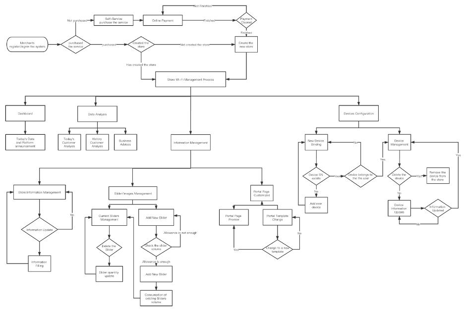

# CSCI3172-GroupProject
<p align="center"><a href="https://www.dal.ca/" target="_blank"></a></p>

***

### CSCI 3172 Fall 2020
### Group Project 
##### Members:
[1] Yanlin Zhu, B00812966,

[2] Xinhai Cheng, B00796386

***

### Instruction

#### Clone the repository

```
git clone https://git.cs.dal.ca/yanlinz/csci3172-groupproject-m3.git
```

#### cd into project dictionary

```
cd csci3172-groupproject-m3
```

#### Install composer packages

```
composer install
```

#### prepare the environment

```
cp .env.example .env  // change the database credentials in .env

php artisan migrate
php artisan db:seed
```

#### Run the app

```
php artisan serve
```

***

### M3 Development Log

We made some changes to our previous design as we encountered many problems during the development.

1. Change of UI Design from horizontal to vertical to make it more compatible with mobile device

2. Deprecated the idea of using latest leased Jetstream Pack of Laravel 8

3. Switch from Vue-Element-Admin to Argon as we decided to drop Vue due to time limitation

***

### About Our Project

Guest Wi-Fi Management System is a Platform as a Service, which combines with
multi-vendor hardware to provide customers with public service network service capability.
This system can both provide vertical customers (merchants) with cloud-based online
network management and information publishing capabilities, and horizontal customers
(merchants' customers) with wireless network authentication, Internet access services and
information services.

Based on Guest Wi-Fi Management System, merchants can manage their store network
hardware and authentication page anytime and anywhere to help them better understand and
control the network. At the same time, Guest Wi-Fi Management System can also help
merchants complete business optimization and data analysis services by properly collecting
user authentication information. Based on the Guest Wi-Fi Management System, merchants
can also enhance their brand building, release important information and promote their
business by customizing the wireless network authentication page. All these functions can
help merchants maximize the utilization of wireless network resources and implement the
business value based on wireless networks.

***

### Light Use Case

<p align="center"> </p>

##### For a Vertical Customers (Merchants):

As shown in the figure, the first part is the user account and service packages check
module. When the merchants complete the registration in the system, they can sign in to the
merchant dashboard. The system will inquire the database to know whether the current user
has the service purchase history or the store information that has been bound in the account.
If this is the first time a merchant has registered or has not ordered any services, the system
will automatically redirect the user to the service purchase page. The user selects the service
plan they need and completes the payment through online payment. The system obtains the
payment status of users through third-party payment platforms, such as Stripe or Paypal, and
allocates corresponding packages for users. After the user opens the service package, the
system will provide binding guidance for customers who are not bound to the store
information, and help users fill in the store information and access the device by using Bring
your own device (BYOD) method.

After completing the configuration of store information or equipment, users can use all the
functions of the system. Users can view the latest announcements through the merchant
dashboard to ensure that they can know the information and system status. At the same time,
users can use the visitor data analysis function to view the big-data of current Wi-Fi visitors
in real time. In addition, users can view the recent historical data and view the business
optimization information given by the system. The information management function can
help users to view and update the store information in real time. At the same time, users can
also delete and upload pictures on Wi-Fi authentication pages to help merchants better
promote their products. All information changes can be previewed through Portal page
management, and templates can be switched through the Portal page management function.

##### For a Horizontal Customers (Merchants' Customers):

When a horizontal customer (the merchant's customer) arrives at the merchant's store to
consume and use the network, it will first turn on the device's Wi-Fi Settings, select and
connect to the merchant's public wireless network. After connecting to the network, with
hotspot protocol, the system will automatically pop up the splash page window. If the system
does not have a pop-up window or the user accidentally closes it, the user needs to reconnect
to Wi-Fi or open the browser to access any website to be redirected to the splash page. Once
the users are redirected to the splash page, they can complete the Internet connection
operation by clicking the "GO ONLINE" button on the page. After the user clicks the button,
the system sends the authentication request to the back-end service, and the back-end service
receives the request and forwards it to the device. Then the user will be redirected to the
success page, so that can browse the Internet normally.

### References

[1] Argon Frontend Preset: https://github.com/laravel-frontend-presets/argon