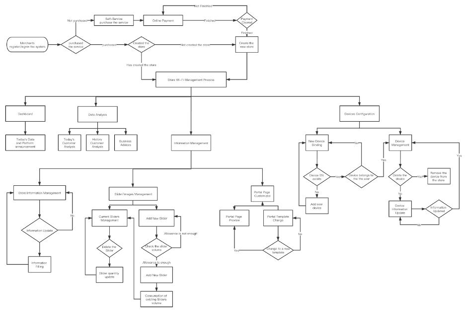

# CSCI3172-GroupProject

***

### CSCI 3172 Fall 2020
### Group Project 
##### Members:
[1] Yanlin Zhu, B00812966,

[2] Xinhai Cheng, B00812966

*** 
### Instruction

***
### M3 Development Log

We made some changes to our previous design as we encountered many problems during the development.

1. Change of UI Design from horizontal to vertical to make it more compatible with mobile device

2. Deprecated the idea of using latest leased Jetstream Pack of Laravel 8

3. Switch from Vue-Element-Admin to Argon as we decided to drop Vue due to time limitation

***
### About Our Project
Guest Wi-Fi Management System is a Platform as a Service, which combines with
multi-vendor hardware to provide customers with public service network service capability.
This system can both provide vertical customers (merchants) with cloud-based online
network management and information publishing capabilities, and horizontal customers
(merchants' customers) with wireless network authentication, Internet access services and
information services.

Based on Guest Wi-Fi Management System, merchants can manage their store network
hardware and authentication page anytime and anywhere to help them better understand and
control the network. At the same time, Guest Wi-Fi Management System can also help
merchants complete business optimization and data analysis services by properly collecting
user authentication information. Based on the Guest Wi-Fi Management System, merchants
can also enhance their brand building, release important information and promote their
business by customizing the wireless network authentication page. All these functions can
help merchants maximize the utilization of wireless network resources and implement the
business value based on wireless networks.

***

### Light Use Case

 

##### For a Vertical Customers (Merchants):
As shown in the figure, the first part is the user account and service packages check
module. When the merchants complete the registration in the system, they can sign in to the
merchant dashboard. The system will inquire the database to know whether the current user
has the service purchase history or the store information that has been bound in the account.
If this is the first time a merchant has registered or has not ordered any services, the system
will automatically redirect the user to the service purchase page. The user selects the service
plan they need and completes the payment through online payment. The system obtains the
payment status of users through third-party payment platforms, such as Stripe or Paypal, and
allocates corresponding packages for users. After the user opens the service package, the
system will provide binding guidance for customers who are not bound to the store
information, and help users fill in the store information and access the device by using Bring
your own device (BYOD) method.

After completing the configuration of store information or equipment, users can use all the
functions of the system. Users can view the latest announcements through the merchant
dashboard to ensure that they can know the information and system status. At the same time,
users can use the visitor data analysis function to view the big-data of current Wi-Fi visitors
in real time. In addition, users can view the recent historical data and view the business
optimization information given by the system. The information management function can
help users to view and update the store information in real time. At the same time, users can
also delete and upload pictures on Wi-Fi authentication pages to help merchants better
promote their products. All information changes can be previewed through Portal page
management, and templates can be switched through the Portal page management function.

##### For a Horizontal Customers (Merchants' Customers):
When a horizontal customer (the merchant's customer) arrives at the merchant's store to
consume and use the network, it will first turn on the device's Wi-Fi Settings, select and
connect to the merchant's public wireless network. After connecting to the network, with
hotspot protocol, the system will automatically pop up the splash page window. If the system
does not have a pop-up window or the user accidentally closes it, the user needs to reconnect
to Wi-Fi or open the browser to access any website to be redirected to the splash page. Once
the users are redirected to the splash page, they can complete the Internet connection
operation by clicking the "GO ONLINE" button on the page. After the user clicks the button,
the system sends the authentication request to the back-end service, and the back-end service
receives the request and forwards it to the device. Then the user will be redirected to the
success page, so that can browse the Internet normally.

***
### Security Strategy
Because our system needs to store, transmit, and process both vertical user (merchant)
and horizontal customer (merchant's customer) data, data security is a significant design and
implementation challenges. To address security challenges, we need to develop strategies for
them. For this system's security policy, we will discuss data collection and processing, data
transmission, and data storage.

The first is data collection and processing. For vertical customers, we need to collect
their personal contact information, such as customer name, contact phone number, contact
email, company name, company address, etc. Simultaneously, we also need to collect the
necessary information of horizontal customers for the server authentication processing, such
as the customer's IP address, Mac address, etc. According to the Privacy Laws in Canada, the
information we collect above is personal and needs to be handled with extra care. Because
any individual or company can not disclose personal privacy, disclosure of personal privacy
is illegal. For the above user data collection, we will complete the HTTPS page after TLS
(Transport Layer Security) encryption transmission to ensure that a third party will not
intercept the user's data. According to Cloudflare (2020), TLS is a widely adopted security
protocol designed to promote communications' privacy and data security over the Internet.
The primary use case for TLS is to encrypt the communication between the Web application
and the server (for example, a Web browser loading a Web site). And because TLS is
asymmetrically encrypted, security is very high, and there is little chance of cracking.
 
Simultaneously, we will use a new, internal encryption algorithm to encrypt and
process user data so that even if POST data is obtained by capturing packets or developer
console, users' plaintext sensitive information cannot be directly seen. For this encryption
algorithm, we will use Base64 to encrypt the user-submitted data and then generate a random
number between 10-99 as the secret key for decryption. Finally, a loop is created, and the
encrypted ciphertext is obtained by replacing and shuffling the data previously encrypted
through Base64 through PHP's substr function. Through TLS and our encryption algorithm,
we can ensure that the user data from the input to the end of the processing are in a safe
encryption state.

Besides, our system also needs to accept users' online payment to get the service, so
sensitive information such as users' credit card information should have individual specific
policies. Stripe, a third-party service provider, is used to collect, transmit, and process
payment information. Stripe's SDK development framework is responsible for collecting and
processing relevant information so that our system will never store and process any credit
card data to ensure payment security.

The second is the data transfer phase, where our most significant challenge comes
from the front-end and back-end interactions, which are mostly based on JSON strings, but
because the JSON strings are plaintext, we need to do extra processing. As mentioned earlier,
we will use TLS and our encryption algorithm to ensure that third parties will not intercept
the content of the front and back end interactions. Even if POST data is obtained through the
developer console or other means, the plaintext information will not be visible. Since our
service consists of a wireless network management system (cloud platform) and hardware,
we also need to deal with data transmission security between the system and the hardware. To
ensure information transmission safety between the system and hardware, we use TOKEN
authentication instead of sending complete service information. When a user initiates an
authentication request from a mobile device browser, the front end will communicate with the
back end and send information such as the user's phone's MAC address. After the back end
completes processing, a temporary TOKEN will be generated and returned to the front end.

After the front end receives the TOKEN, it will send the TOKEN to the current
network device, complete authentication by communicating with the Radius server and
back-end server. The device will release the internet access to the user after a valid TOKEN
authentication is passed. In the whole authentication phase, the data transmission does not
involve user information or any sensitive information, which greatly protects the data
security.

Meanwhile, since the device and the Radius authentication server use Radius over
TLS (RADSEC) to encrypt the transmission, any third party cannot listen to or decrypt the
data. Through the above data encryption transmission scheme, even in the worst case, the
hacker can only obtain user TOKEN, which cannot be reversely converted into useful
information and cannot be used for a long time. Therefore, the above data transmission
security policy is feasible and effective.

After data collection, processing, and transmission, we also need to store user data.
How to store user data securely is also a great challenge for our system and the entire Internet
industry. In terms of data storage security, we will adopt the MySQL remote dual live
solution to deploy clusters in two or more different places. By deploying clusters in two or
more different cities, business stability and data storage security can be significantly
enhanced. Even in irreversible data corruption in one data center, the other data center
provides stable and secure data backups that allow businesses to switch to the backup data
center immediately. Simultaneously, in addition to storage security, the security of stored
data is also worth our attention. We will apply strict authority management and SQL
statement auditing platforms to each MySQL cluster to ensure that permissions are traceable
and execution content traceable. As long as an authorized technician can access the database
on loan from a jumper and its access rights are strictly limited, unauthorized data cannot be
accessed across rights. At the same time, the database is only open to the specified IP access
rights to ensure that the database can only be accessed and used by our internal systems.

In addition to the security policy we specify in the Wi-Fi management system's design
and deployment, we can also use additional security protection systems to ensure the whole
service system's security. We will deploy WAF (Web Application Firewall) to all Web-based
services to filter for bad access and malicious attacks. WAF can block unauthorized access to
our system, XSS or SQL injection attacks, DDoS attacks, etc., to maximize the system's
security and stability. Even when the system appears vulnerable, there is still a certain degree
of protection. At the same time, WAF can provide more flexible access control capability
than traditional hardware firewalls. WAF can help us prevent unauthorized users from
accessing sensitive information, such as blocking non-white list IP addresses, browser UA
access to the system administrator dashboard. Not only that, WAF can prevent user privacy
disclosure and the collection of malicious crawlers to protect the privacy security of users.
Therefore, deploying WAF outside of our system is a layer of protection.

Through the development and deployment of the above security policies for the
system, we can fully protect the security of the system from data acquisition, processing,
transmission, and storage, and protect the privacy of customers from being disclosed

